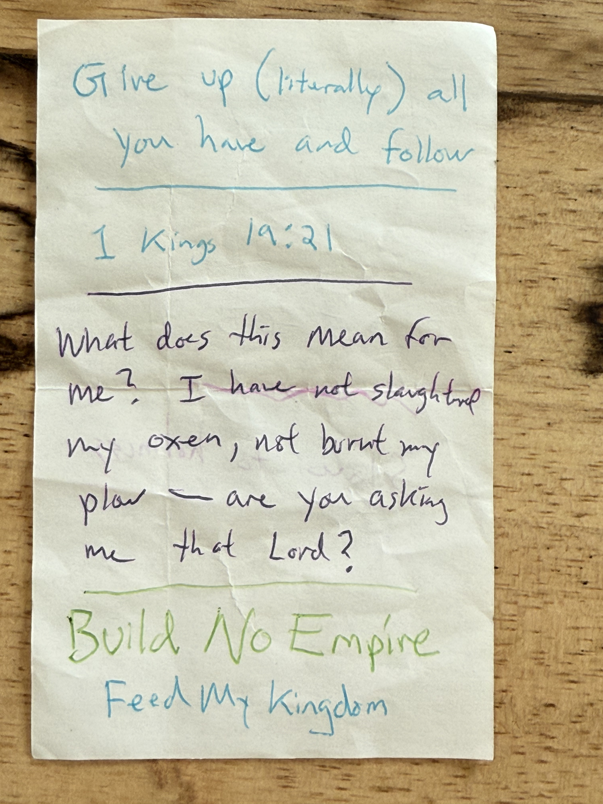
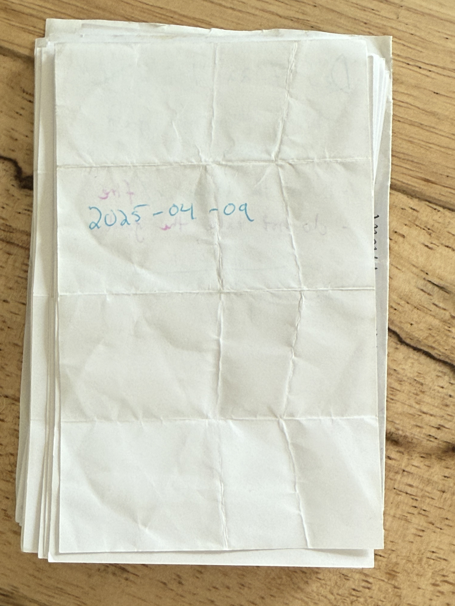
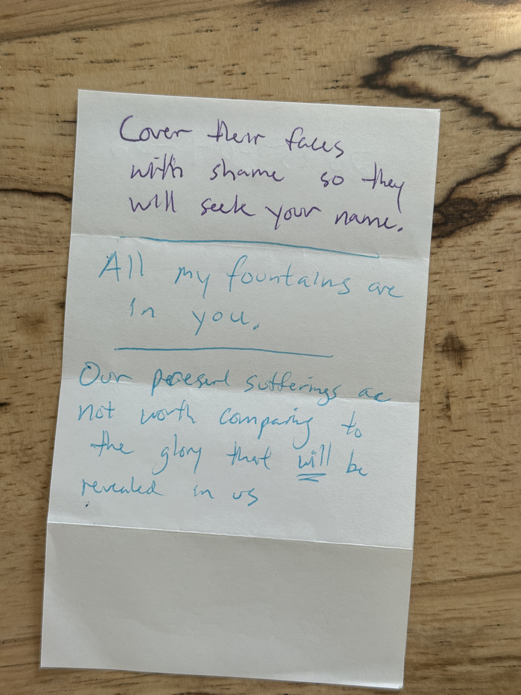

# Wilderness Notes - March 25 to May 3, 2025

## 2025-03-25 Day 1

 | 

I imbued you with zeal for me.

**Habakkuk 2:18-19** - _"Of what value is an idol carved by a craftsman? Or an image that teaches lies? For the one who makes it trusts in his own creation; he makes idols that cannot speak. Woe to him who says to wood, 'Come to life!' Or to lifeless stone, 'Wake up!' Can it give guidance? It is covered with gold and silver; there is no breath in it."_

**Romans 2:23** - _"You who boast in the law, do you dishonor God by breaking the law?"_

**Romans 2:25** - _"Circumcision has value if you observe the law, but if you break the law, you have become as though you had not been circumcised."_

There is no breath in it for His creation works through power under.

Romans starts by condemning the "other" then in 2 flips it - how can you judge? (v4) - [BIG?]

---

## 2025-03-26 Day 2

 | 

I got angry at someone for reserving a car charger. Then found out I was that person's skip.

Read this & repented.

Patience as a way of God yields repentance.

**Romans 2:15** - _"They show that the requirements of the law are written on their hearts, their consciences also bearing witness, and their thoughts sometimes accusing them and at other times even defending them."_

No one does good

**Leviticus 16:15** - _"He shall then slaughter the goat for the sin offering for the people and take its blood behind the curtain and do with it as he did with the bull's blood: He shall sprinkle it on the atonement cover and in front of it."_

**Galatians 3:6** - _"So also Abraham 'believed God, and it was credited to him as righteousness.'"_

→ Goat in the wilderness

**Psalm 18:19** - _"He brought me out into a spacious place; he rescued me because he delighted in me."_

To the devious you are shrewd

---

## 2025-03-27 Day 3

 | 

If I try to please people, I am NOT a servant of God.

**Galatians 1:10** - _"Am I now trying to win the approval of human beings, or of God? Or am I trying to please people? If I were still trying to please people, I would not be a servant of Christ."_

Paul claims he was not taught.

Continue to remember the poor.

Do not provoke

**Fruit of the Spirit (Galatians 5:22-23):**
- Love (the whole of the Law)
- Joy
- Peace
- Forbearance/Patience
- Kindness
- Goodness
- Faithfulness
- Gentleness
- Self-control

---

## 2025-03-28 Day 4

 | 

HS is an AGENT He has AGENCY.

The HS is reliable and a seal of that hope.

We feel the Spirit.

Assurance of the hope.

**Ephesians 1:14** - _"who is a deposit guaranteeing our inheritance until the redemption of those who are God's possession—to the praise of his glory."_

Walking in/Aligning step with the Lord (dikaiosune) is believing, trusting and having FAITH that:
- He is who He says
- Will do what He promises

"You will circle life"
- this was separate from the building. It was growth.

Glory in our sufferings because we know that suffering produces:
- perseverance per severance
- character
- hope

Hope does NOT put us to shame because God's love has poured into our hearts through HS who has been given to us

---

## 2025-03-29 Day 5

 | 

How much MORE grace will the Lord pour out compared to the death from Adam.

Life & Grace

Life > death

Buried w/ Christ through Baptism

**1 Peter 1:4** - _"and into an inheritance that can never perish, spoil or fade. This inheritance is kept in heaven for you,"_

The inheritance is kept in Heaven until the Coming of the Salvation READY to be REVEALED

---

## 2025-03-30 Day 6

Elijah was Zealous

Trust the King

by taking up your cross

what are you asking of me?

Help, Support, Sacrifice

---

## 2025-03-31 Day 7

 | 

Slave to holiness

Give up (literally) all you have and follow

**1 Kings 19:21** - _"So Elisha left him and went back. He took his yoke of oxen and slaughtered them. He burned the plowing equipment to cook the meat and gave it to the people, and they ate. Then he set out to follow Elijah and became his servant."_

What does this mean for me? I have not slaughtered my oxen, not burnt my plow - are you asking me that Lord?

Build No Empire

Feed My Kingdom

---

## 2025-04-01 Day 8

 | 

You are already called to bear My Name.

**Isaiah 43:1** - _"But now, this is what the LORD says— he who created you, Jacob, he who formed you, Israel: 'Do not fear, for I have redeemed you; I have summoned you by name; you are mine.'"_

Don't deceive yourself it's not easy and that's OK. You do not stand condemned and nothing can separate or cut off the love from Christ.

---

## 2025-04-02 Day 9

 | 

Jesus is Lord

**Romans 10:9** - _"If you declare with your mouth, 'Jesus is Lord,' and believe in your heart that God raised him from the dead, you will be saved."_

vs

**Matthew 7:21** - _"Not everyone who says to me, 'Lord, Lord,' will enter the kingdom of heaven, but only the one who does the will of my Father who is in heaven."_

Be the one who does His will.

- Love
- Faith
- Hope

Open up to His Grace

---

## 2025-04-03 Day 10

 | 

For Him, To

From Him, Through Him, For Him are all things

Living Sacrifice

Do not conform Be transform by the renewing of your Mind

**Psalm 100** - _"Shout for joy to the LORD, all the earth. Worship the LORD with gladness; come before him with joyful songs."_

---

## 2025-04-04 Day 11

 | 

He did!

I answered my prayer

I have hope.

Give what is owed

Respect & Honor

Clothe ourselves in Jesus

**Romans 14:7-8** - _"For none of us lives for ourselves alone, and none of us dies for ourselves alone. If we live, we live for the Lord; and if we die, we die for the Lord. So, whether we live or die, we belong to the Lord."_

Live for the Lord

Die for the Lord

**Daniel 1:17** - _"To these four young men God gave knowledge and understanding of all kinds of literature and learning. And Daniel could understand visions and dreams of all kinds."_

Hear me Lord!

Save my team

---

## 2025-04-05 Day 12

 | 

Help me do Your will today

I am your servant

train me

Accept and bear with one another

**(Tertius)**

Keep away from these who cause division and put obstacles

Deep calls to deep

---

## 2025-04-06 Day 13

 | 

My interpretation:
- Do not solve Support myself Let the Law go ahead
- Offer peace or an arrangement to GBO
- Trust the Lord when it is time to fight

Caleb will see it because he followed WHOLEHEARTEDLY

? the Lord was angry w/Moses because of Israel?

Do not fight

I am going ahead of you

You have not lacked anything

The "fighting men" were eliminated from the camp.

The King (Sihon) refused passage.

him & his sons & all were destroyed

---

## 2025-04-07 Day 14

 | 

Create no idol

Made you hear His voice to discipline you.

Cities of refuge

---

## 2025-04-08 Day 15

 | 

The fire will consume us - why should we die? (This is good)

Lord let your presence and fire consume me

Help me do your will in this life.

Remind me of what you have already said

---

## 2025-04-09 Day 16

 | 

**Deuteronomy 7:22** - _"The LORD your God will drive out those nations before you, little by little. You will not be allowed to eliminate them all at once, or the wild animals will multiply around you."_

throwing them into great confusion

- burn the images w/ fire
- do not take the gold

How long?

---

## 2025-04-10 Day 17

 | 

It is He that gives the ability to produce wealth and so confirms His covenant.

It is their wickedness that they are driven of

NOT your righteousness

To fear God, walk, obey love, serve wholly, observe the commandments

Everything with BREATH praise the Lord.

---

## 2025-04-11 Day 18

 | 

Obey so that you have strength to take possession.

You are our Patient King

"In the quiet patience of your heart - there is a seed"

---

## 2025-04-12 Day 19

 | 

Daniel remained. (cont)

The knowledge was a response to prayer. And to injustice!

Your free offerings are to be enjoyed before the Lord - thus we worship

Do not neglect the Levites

**Deuteronomy 12:20** - _"When the LORD your God has enlarged your territory as he promised you, and you crave meat and say, 'I would like some meat,' then you may eat as much of it as you want."_

---

## 2025-04-13 Day 20

 | 

Debt cancellation was intended for within Israel

**Deuteronomy 15:3** - _"You may require payment from a foreigner, but you must cancel any debt your fellow Israelite owes you."_

"There should be no poor among you"

There will always be the poor so give open-handed

Peace

---

## 2025-04-14 Day 21

 | 

Peacemakers will be called Children of God

Let your light shine

Simply yes or no

Do not be angry

Cut off that which causes you to sin

You must purge the evil from among you.

---

## 2025-04-15 Day 22

 | 

Kill a cow as a way to atone.

A sign of the Father's strength is a sin.

You must purge the evil from among you.

Do not ignore lost things 3rd gen Egyptians are cool?

Anger is greed for being denied an Adamic will.

---

## 2025-04-16 Day 23

 | 

Eat what I give you.

Do not be afraid whether they listen or do not

---

## 2025-04-17 Day 24

 | 

Let others take refuge whatever your lips utter Do

From a dream: whatever you ask of others they will do - be wise

Jesus performed two miracles for the men
- Calming the storm
- Exorcising demons

Then will be no more night

Jesus is the Morning Star?

---

## 2025-04-18 Day 25

 | 

"You have said so"

- never revealed Judas
- probably acknowledged him

The spirit of God is willing but our flesh is weak

- He called Judas friend

Remained Silent against His accusers.

"You have said so" to Priest

**Matthew 26:64** & **Psalm 42** - _"The Mighty One"_

"You have said so" to Pilot

---

## 2025-04-19 Day 26

 | 

To covet is to refuse to accept one's own limitations.

Carefully follow all these commands

(Substitutional Obedience?)

Woe to those who follow their own Spirit.

Have seen nothing

Opened their minds

He will come back the same way.

---

## 2025-04-20 Day 27

 | 

A tent awaiting what is kept alive in Christ in Heaven until the Resurrection

---

## 2025-04-21 Day 28

 | 

Cursed w/ an anxious mind for not following God's commandments.

Brutal curses.

Our true identity is hidden but will be given as a white stone Known only to us.

Those 2 laws, be disciples

---

## 2025-04-22 Day 29

 | 

Cover their faces with shame so they will seek your name.

All my fountains are in you.

Our present sufferings are not worth comparing to the glory that will be revealed in us

---

## 2025-04-23 Day 30

 | 

**Deuteronomy 29:6** - _"You ate no bread and drank no wine or other fermented drink. I did this so that you might know that I am the LORD your God."_

I led you through the desert so that you know that I am God.

Success in the Kingdom is loving others

The new command is to do that as Jesus did

---

## 2025-04-24 Day 31

 | 

Secret things belong to the Lord

BUT revelations belong to us & our children

- You will create life
- Hummingbird nature

Listen First

then Help

He will not leave you or forsake you. Do not be afraid or discouraged

Trust as you go to the land & OBEY

---

## 2025-04-25 Day 32

 | 

He knows what we are disposed to do

The world will pass away in it's current state.

Whoever does the Will of God.

JOIN THE PARTY!

---

## 2025-04-26 Day 33

 | 

Your ways are perfect

Annoying God w/ created idols (that start worship)

**Deuteronomy 31:20** - _"When I have brought them into the land flowing with milk and honey, the land I promised on oath to their ancestors, and when they eat their fill and thrive, they will turn to other gods and worship them, rejecting me and breaking my covenant."_

**Deuteronomy 32:16** - _"They made him jealous with their foreign gods and angered him with their detestable idols."_

The world & His desires actually pass away

---

## 2025-04-27 Day 34

 | 

**Deuteronomy 32:21** - _"They made me jealous by what is no god and angered me with their worthless idols. I will make them envious by those who are not a people; I will make them angry by a nation that has no understanding."_

& :30

Your ways are not my ways.

Welcome the least

Love your neighbors

---

## 2025-04-28 Day 35

 | 

The Day of the Lord is coming for created things

**Isaiah 2:12-17** - _"The LORD Almighty has a day in store for all the proud and lofty, for all that is exalted (and they will be humbled)... The arrogance of man will be brought low and human pride humbled; the LORD alone will be exalted in that day."_

The plunder from the poor is in your houses

**Isaiah 3:14** - _"The LORD enters into judgment against the elders and leaders of his people: 'It is you who have ruined my vineyard; the plunder from the poor is in your houses.'"_

Moses did NOT become Joseph. He did NOT become a governor.

---

## 2025-04-29 Day 36

 | 

Stop Doing Wrong

Learn to do right : seek justice

Defend the oppressed

Immediately "Your sins [will be] white as snow"

Soar on wings like eagles

---

## 2025-04-30 Day 37

 | 

**John 14:23** - _"Jesus replied, 'Anyone who loves me will obey my teaching. My Father will love them, and we will come to them and make our home with them.'"_

If you love Jesus you will obey His teachings and He will come to you.

Peace he gives but not as the world does

Do not ALLOW your hearts to be troubled and do not be afraid.

Proof of the world comes so that the world knows that Jesus loves the Father

Enjoy the writing

---

## 2025-05-01 Day 38

 | 

The Father's glory came to Jesus through the Church

**John 17:10** - _"All I have is yours, and all you have is mine. And glory has come to me through them."_

**John 17:22** - _"I have given them the glory that you gave me, that they may be one as we are one."_

The Father's name is the name He gave Jesus
→ Protects us by His name?

Dream: "Get out of the metrg"

Unity & Communion w/ Jesus & the Father

---

## 2025-05-02 Day 39

 | 

Our present suffering mirrors in small and bearable ways the suffering that Jesus endured - so that we may know He loves us and our sanctified in Him

---

## 2025-05-03 Day 40

 | 

He looks for justice

**Isaiah 5:8** - _"Woe to you who add house to house and join field to field till no space is left and you live alone in the land."_

Lambs will feed in the ruins of the rich

**Isaiah 6:2** - _"Above him were seraphim, each with six wings: With two wings they covered their faces, with two they covered their feet, and with two they were flying."_

Seraphim covered faces like Ezekiel?

If you do not stand firm in your Faith you will not stand.

---

## 2025-04-03 Day 10 (Additional Note)

 | 

(Lost my other one)

I think God is trying to tell me that His words on my heart matter MORE than this new ritual

Shout for Joy to the Lord all the Earth

Worship w/ Gladness

Come before Him with joyful Songs

Know that the Lord is God

Only the Lord is grading me.
